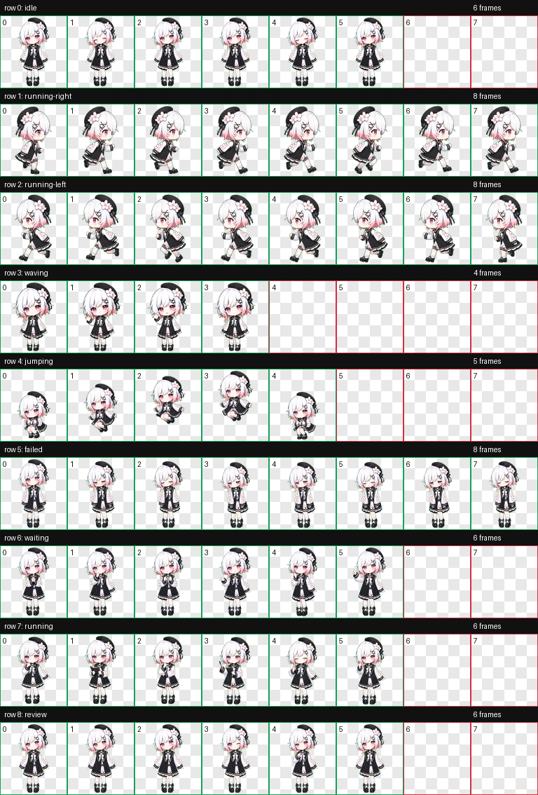

# Codex Pet: Sakuraba Ema

一个非官方的 Codex 小人宠物包。

Created with Codex using the hatch-pet workflow from a provided character reference.



## 中文说明

这是一个基于《魔法少女ノ魔女裁判》角色形象制作的非官方粉丝二创 Codex pet。

本仓库仅用于个人使用、学习和粉丝交流，不是官方素材，不代表官方立场，也不应被误认为官方发布内容。

## 安装

把 `sakuraba-ema` 文件夹复制到你的 Codex pets 目录：

```text
~/.codex/pets/
```

Windows 通常是：

```text
C:\Users\<you>\.codex\pets\
```

最终路径应该类似：

```text
~/.codex/pets/sakuraba-ema/pet.json
~/.codex/pets/sakuraba-ema/spritesheet.webp
```

如果 Codex 没有立刻显示该宠物，请重启 Codex。

## 文件结构

```text
sakuraba-ema/
  pet.json
  spritesheet.webp

assets/
  contact-sheet.png
```

## 授权与权利说明

仓库中的说明文档和打包结构以 MIT License 发布。

角色形象、角色设计及相关原作权利属于其原权利方。本仓库中的 `spritesheet.webp` 和 `assets/contact-sheet.png` 是非官方粉丝二创资源，不按 MIT License 授权，不应用于商业用途，也不应作为官方素材再发布。

更多说明见 [NOTICE](NOTICE)。

---

## English

This is an unofficial fan-made Codex pet package inspired by a character from *Majo Saiban* / *魔法少女ノ魔女裁判*.

It is intended for personal use, learning, and fan sharing only. It is not official material, is not endorsed by the rights holders, and should not be presented as an official release.

## Install

Copy the `sakuraba-ema` folder into your Codex pets directory:

```text
~/.codex/pets/
```

On Windows, this is usually:

```text
C:\Users\<you>\.codex\pets\
```

The final path should look like:

```text
~/.codex/pets/sakuraba-ema/pet.json
~/.codex/pets/sakuraba-ema/spritesheet.webp
```

Restart Codex if the pet does not appear immediately.

## License And Rights

The repository documentation and packaging structure are released under the MIT License.

The character design and related original IP belong to their respective rights holders. `spritesheet.webp` and `assets/contact-sheet.png` are unofficial fan-made assets and are not licensed under the MIT License. Do not use them commercially or redistribute them as official material.
